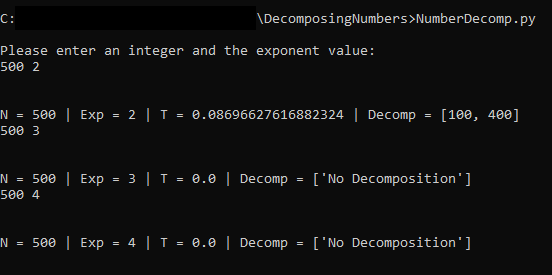
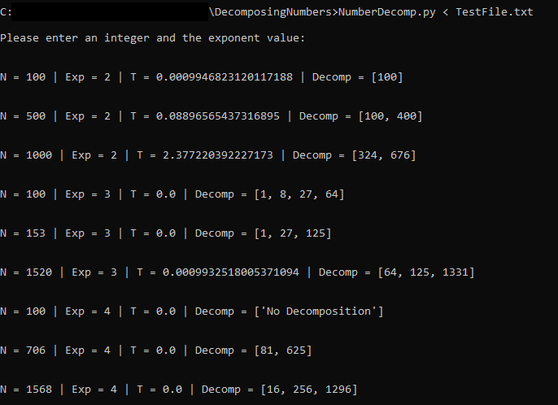

# Decomposing Numbers
A simple python program to decompose an integer into square roots, cube roots, and fourth roots (if possible).
The program promts the user to enter an integer and the exponent value or a .txt file can be used

Example inputs: 

500 2 (This will find the shortest list of square roots that add to 500)  
500 3 (This will find the shortest list of cube roots that add to 500)  
500 4 (This will find the shortest list of fourth roots that add to 500)  

This program also allows for a text file input by using " < "

Example file input: NumberDecomp.py < file_name.txt

# Here are some screenshots of the running code!

### Example of running the program with user input:

### Example of runnin the code with file input:

# Output of the program

The output of each decompositon includes the number value, exponent value, time for calculation, and the decompositon. 
If a number cannot be decomposed, it will display 'No Decompositon'
